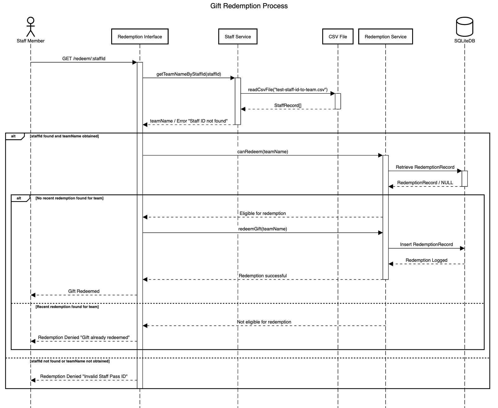

# Gift Redemption System

This project is a Node.js and TypeScript-based system designed to facilitate the annual gift redemption process for teams within a department during the Christmas season. It allows team representatives to redeem their team's gift by verifying their staff pass ID against a mapping file and checking the team's eligibility based on past redemptions.

## Features

- **Staff Pass ID Verification:** Validates a representative's staff pass ID against a predefined CSV mapping file.
- **Redemption Eligibility Check:** Determines if a team is eligible to redeem their gift based on past redemption records.
- **Redemption Record Management:** Adds new redemption records for eligible teams and prevents duplicate redemptions within the same year.

## Assumptions

- Each staff pass ID uniquely identifies a team representative.
- Each team is eligible to redeem one gift per calendar year.
- The created_at timestamp in the staff-to-team mapping indicates when the mapping was established, not necessarily the team's redemption history.

## Getting Started

### Prerequisites

- Node.js
- npm (comes with Node.js)

### Installation

1. Clone the repository:

```bash
git clone https://github.com/kylie-kiaying/gift-redemption-system
cd gift-redemption-system
```

2. Install the project dependencies

```bash
npm install
```

3. Running the service

```bash
npm start
```

This will launch the redemption service on http://localhost:3000 (default port). You can use tools like Postman to interact with available endpoints.

### Available Endpoints

**Redeem a Gift**
Method: GET  
Endpoint: /redeem/:staffId  
Description: Redeems a gift for the team associated with the provided staff ID. Returns success or error message.


### Running Tests

Run the unit tests with:
```bash
npm test
```

## Database Management

The SQLite database is used to store redemption records. It is chosen for simplicity, ease of setup, and the ability to handle the data volume expected for this use case.  
The database.ts file includes utilities for managing the database:  

- **Initializing Tables:** Automatically done when starting the service.
- **Viewing Redemption Records:** Uncomment `dbInstance.showTable();` in `database.ts` to print all records.
- Clearing Redemption Records: Uncomment `dbInstance.clearRedemptionRecords()`; in `database.ts` to clear the table.

## Sequence Diagram

